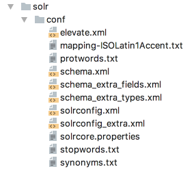

# Enabling Apache Solr service

## Docksal configuration

Add the Apache Solr service to `.docksal/docksal.yml` under `services`.

```yaml
# Solr
solr:
  hostname: solr
  image: docksal/solr:1.0-solr4
```

Run `fin up` to apply the new configuration.

## Drupal configuration

Enable all required by your version of Drupal modules for the Apache Solr search integration.

For Apachesolr module add your Solr server using following server url:

```
http://solr:8983/solr
```

For the Search API module use these values:

| Name | Value |
|---|---|
| Protocol | `HTTP` |
| Host | `solr` |
| Port | `8983` |
| Solr path | `/solr` |
| Solr core |  |

## Updating Solr configuration

Say you need to update your `schema.xml` or other configuration.

You can put all your custom Solr config files to the `.docksal/etc/solr/conf` folder:



Then update your `.docksal/docksal.yml` to mount them in the `solr` service:

```yaml
# Solr
solr:
  hostname: solr
  image: ...
  volumes:
    - ${PROJECT_ROOT}/.docksal/etc/solr/conf:/var/lib/solr/conf:ro
```

Apply configuration changes with `fin up`
