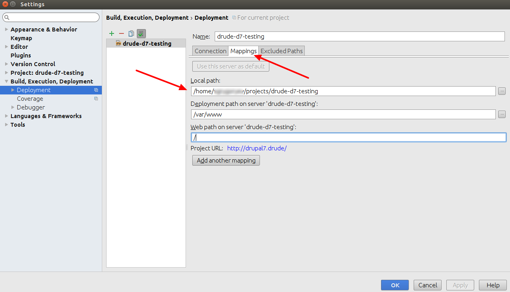
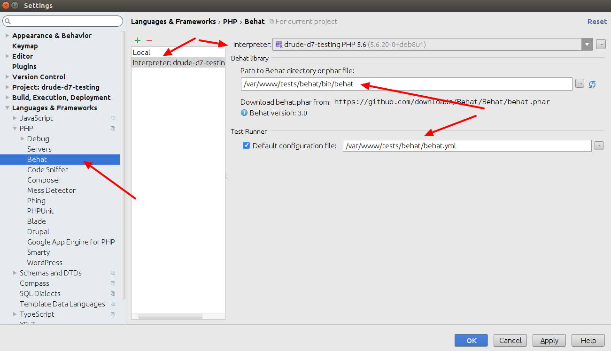
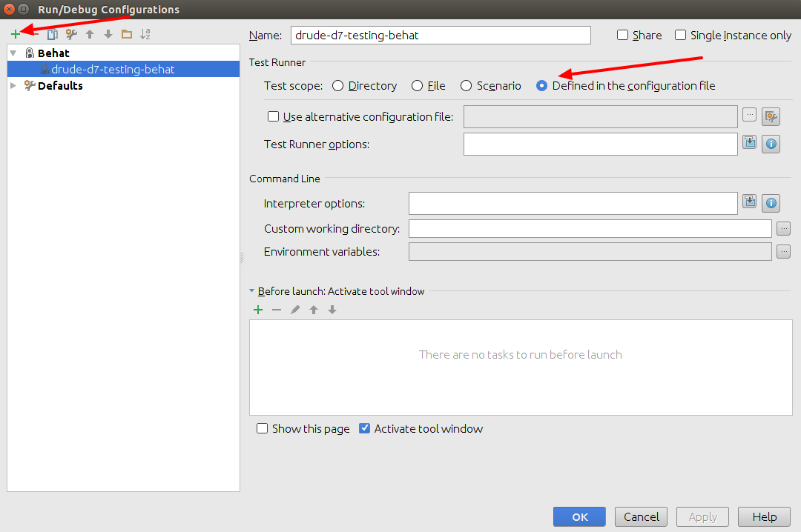
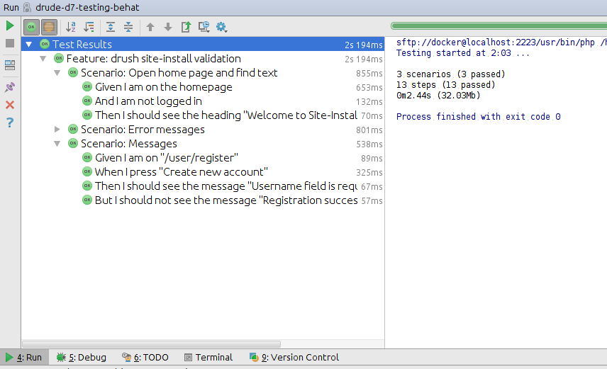
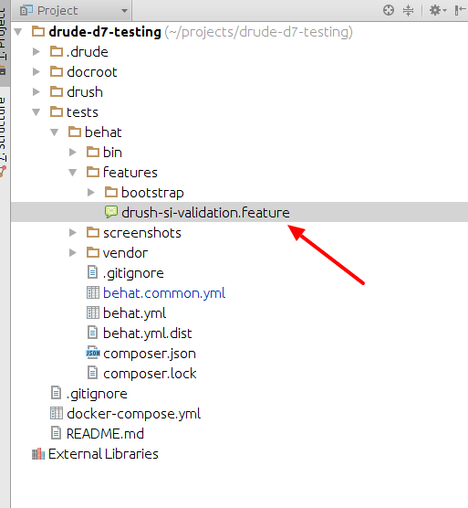

# Using Behat

## Expected folder structure

Drude expects your Behat tests to be in `tests/behat` folder of the project repo.

>     tests/behat
>       \_ bin/behat
>       \_ behat.yml
>       \_ composer.json
>       \_ composer.lock

See [drude-testing](https://github.com/blinkreaction/drude-testing) repo for a good working example. This repo is used for automated tests of Drude builds.

## Docker profile example

Assuming you are using [Behat Drupal Extension](https://github.com/jhedstrom/drupalextension) add the following profile in your `behat.yml` file:

```yml
# Docker profile.
# For use inside the CLI container in Drude.
docker:
  extensions:
    Behat\MinkExtension:
      # URL of the site when accessed inside Drude.
      base_url: http://hello-world.drude
      selenium2:
        wd_host: http://browser.hello-world.docker:4444/wd/hub
      # Stick with chrome by default. It's 2x faster than firefox or phantomjs (your results may vary).
      browser_name: chrome
    Drupal\DrupalExtension:
      drupal:
        # Site docroot inside Drude.
        drupal_root: /var/www/docroot
      drush:
        # Site docroot inside Drude.
        root: /var/www/docroot
```

This will configure Behat for use with Drude.

**Important note**

`base_url: http://hello-world.drude` and `wd_host: http://browser.hello-world.docker:4444/wd/hub`
should be configured based on your `docker-compose.yml` settings for `VIRTUAL_HOST` 
in the web container definition and `DOMAIN_NAME` in the browser container definition.  

## Running tests

Tests can be launched with `dsh` (Drude Shell):

    dsh behat

This will download composer dependencies and run behat with the docker profile.

## Behat (goutte-driver)
Basic configuration (see behat.common.yml) uses goutte as default driver (headless browser emulator is used).
Headless browser can do HTTP requests and emulate browser applications on a high level (HTTP stack), but on a lower level (JS, CSS) it is totally limited.
It is much faster than real browsers, because you don’t need to parse CSS or execute JS in order to open pages or click links with them.

It can be used in many cases and you don't need additional configuration/installation.

## Behat (selenium2-driver)
If tests are using javascript, selenium2-driver will be used. Also you can use selenium2-driver as default driver.
In-browser emulator is used in this case. It works with real browsers, taking full control of them and using them as zombies for its testing needs.
This way, you’ll have a standard, fully-configured, real browser, which you will be able to control. CSS styling, JS and AJAX execution - all supported out of the box.

The esiest way to enable selenium support is to use preconfigured selenium docker images.
Please update docker-compose.yml file in you project folder. Example:
```yml
# selenium2 node
# Uncomment the service definition section below and the link in the web service above to start using selenium2 driver for Behat tests requiring JS support.
browser:
  hostname: browser
  image: selenium/standalone-chrome
  ports:
    - "4444"
  environment:
    - DOMAIN_NAME=drude-d7-testing.browser.docker
```
Also you can use firefox image: selenium/standalone-firefox
Please update behat.yml configuration. You need to add your selenium configuration (evironment variable DOMAIN_NAME is used as selenium2 wd_host). Example:
```yml
# Docker profile.
# For use inside the CLI container in Drude.
docker:
  extensions:
    Behat\MinkExtension:
      # URL of the site when accessed inside Drude.
      base_url: http://drupal7.drude
      selenium2:
        wd_host: http://drude3-d7-testing.browser.docker:4444/wd/hub
      # Stick with chrome by default. It's 2x faster than firefox or phantomjs (your results may vary).
      browser_name: chrome
    Drupal\DrupalExtension:
      drupal:
        # Site docroot inside Drude.
        drupal_root: /var/www/docroot
      drush:
        # Site docroot inside Drude.
        root: /var/www/docroot
```


## Behat (selenium2-driver) - using VNC
If you use selenium with browser from docker container, you can recieve test screenshots but you cann't see how test are running in browser.
Sometimes it is very useful to see running test in browser (for example: when you are creating new test and want to see how it works in browser).
You can use VNC (https://en.wikipedia.org/wiki/Virtual_Network_Computing) in this case:

1. Install VNC client on your computer (there are many version for all platforms).
2. Update docker-compose.yml file in you project folder:
```yml
# selenium2 node
# Uncomment the service definition section below and the link in the web service above to start using selenium2 driver for Behat tests requiring JS support.
browser:
  hostname: browser
  image: selenium/standalone-chrome-debug
  ports:
    - "4444"
    - "5900:5900"
  environment:
    - DOMAIN_NAME=drude-d7-testing.browser.docker
```
You need to use selenium/standalone-chrome-debug or selenium/standalone-firefox-debug image. They both are included VNC server.
For VNC-client please use "localhost:5900" as the host and "secret" as the password.
Now if you connect with VNC-client and run behat test, you will see browser and running tests.

Also you can configure any other port (if you have few running projects, it is usefull to have separate port per project). For example port is 5901, configuration will be:
```yml
..
  ports:
    - "4444"
    - "5901:5900"
...
```

## Integration with PHPstrom
It is possible to connect PhpStorm with cli container and running behat-test from PhpStorm.
PhpStorm uses ssh for connecting and you need to use cli-container with ssh-server.
For now latest version of cli-image contains ssh-server.

### Cli with ssh-server
Please update **docker-compose.yml**:
```yml
# CLI node
cli:
  hostname: cli
  image: blinkreaction/drupal-cli:latest
  ...
  ports:
    - "2223:22"
  ...
```
After restarting containers (**dsh up**) you should be able to connect to cli-container with ssh. Use username *docker* and pasword *docker*:
> ssh docker@localhost -p 2223

You can use any other port (not only 2223).

### Add new deployment server
Open settings (menu item *File->Settings...*). In openned windows on left side select item *Build, Execution, Deployment->Deployment*:


Create new SFTP connection and fill form. Don't foget to fill *Web server root URL*.
Press *Test SFTP connection...* button and if everything is ok, you will see that test is successful.

On the second tab you should to check and correct mapping:



Local path is path to your project on the host machine.
Deployment path is */var/www*

### Add new PHP interpreter
Open settings (menu item *File->Settings...*). In openned windows on left side select item *Languages & Frameworks->PHP*:


To add new interpreter click on **...** button on *Interpreter:* line.


In new openned window add new interpreter and choose **Deployment configuration** option and deployment server from select list (it should be server from previous step).

### Add Behat interpreter configuration
Open settings (menu item *File->Settings...*). In openned windows on left side select item *Languages & Frameworks->PHP->Behat*:



Add new PHP interpreter for Behat (it should be interpreter from previous step).

Path to behat is path in cli-container - **/var/www/tests/behat/bin/behat**

Default configuration file: **/var/www/tests/behat/behat.yml**

Please check that you **behat.yml** contains wd_host for selenium in *Behat\MinkExtension* part:


It should be same as in **behat.common.yml** for docker part.

### Add Behat debug configuration
Open *Run/Debug Configurations* (menu item *Run->Edit Configurations...*). In openned windows on left side add new Behat configuration:



Just choose Test Runner option *Defined in the configuration file*.

### Run tests
On the PhpStorm panel choose Behat debug configuration and run it:


If everything is ok, you will see openned windows with tests result (all tests are runned in this case):



You can re-run any scenario from this windows. If you click on scenario or test, PhpStorm will open window with this scenario/test.

You can also open folder with Behat Features (directory in your projects **tests/behat/features**) and
run any feature tests by right clicking on it and choosing **Run 'feature-name'** option.



## Using host selenium2-driver
@todo