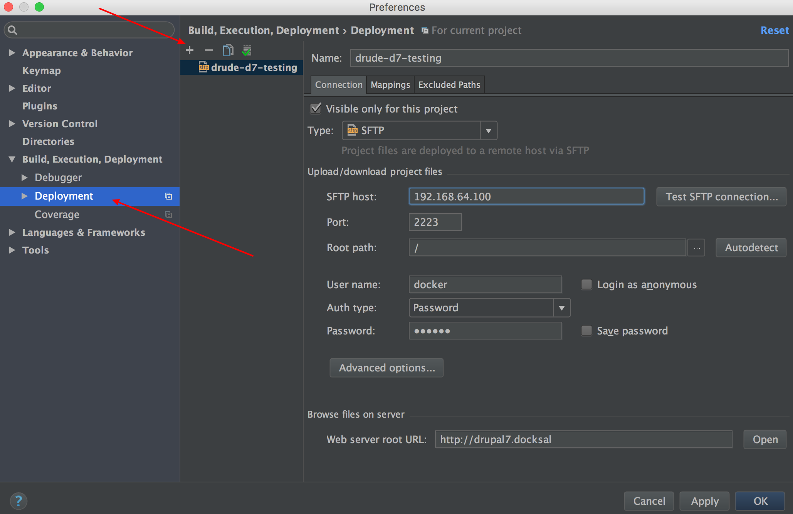
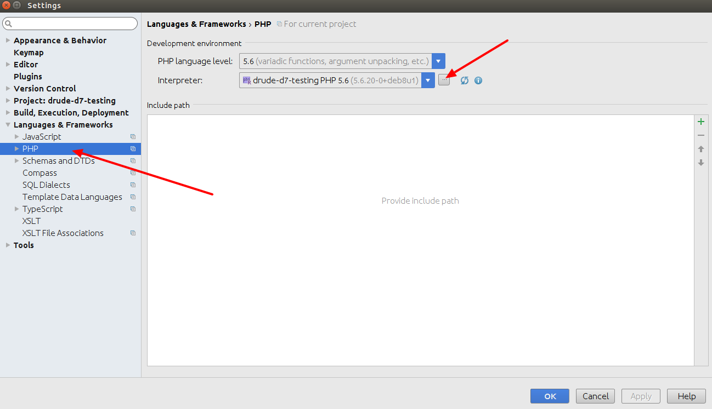
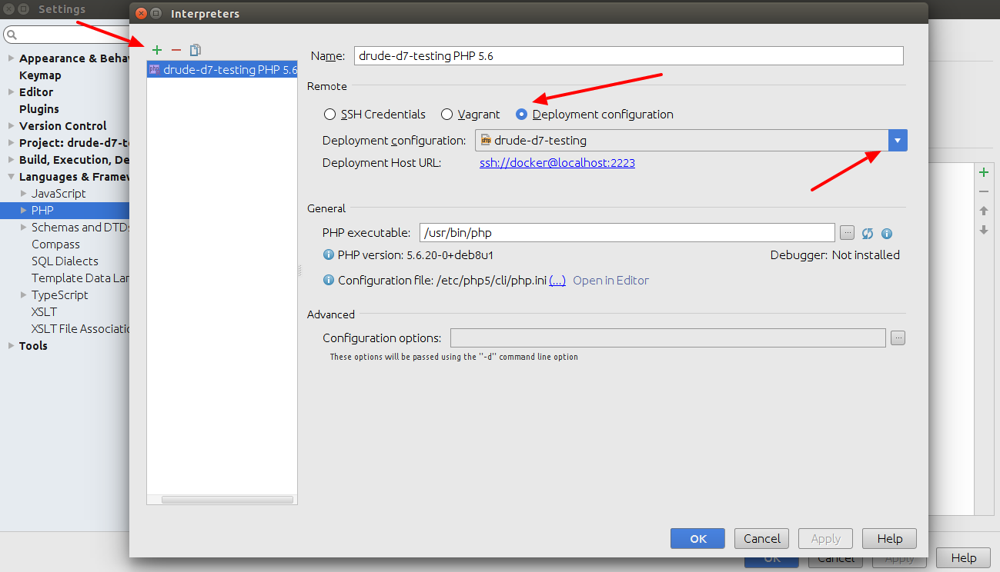

# Using Behat

## Expected folder structure

Docksal expects your Behat tests to be in `tests/behat` folder of the project repo.

>     tests/behat
>       \_ bin/behat
>       \_ behat.yml
>       \_ composer.json
>       \_ composer.lock

See [Drupal 7 sample project](https://github.com/docksal/docksal-drupal7) repo for a working example.

## Docker profile example

Assuming you are using [Behat Drupal Extension](https://github.com/jhedstrom/drupalextension) add the following profile in your `behat.yml` file:

```yml
# Docker profile.
# For use inside the CLI container in Docksal.
docker:
  extensions:
    Behat\MinkExtension:
      # URL of the site when accessed inside Docksal.
      base_url: http://hello-world.docksal
      selenium2:
        wd_host: http://browser.hello-world.docker:4444/wd/hub
      # Stick with chrome by default. It's 2x faster than firefox or phantomjs (your results may vary).
      browser_name: chrome
    Drupal\DrupalExtension:
      drupal:
        # Site docroot inside Docksal.
        drupal_root: /var/www/docroot
      drush:
        # Site docroot inside Docksal.
        root: /var/www/docroot
```

This will configure Behat for use with Docksal.

**Important note**

`base_url: http://hello-world.docksal` and `wd_host: http://browser.hello-world.docker:4444/wd/hub`
should be configured based on your `docker-compose.yml` settings for `VIRTUAL_HOST` 
in the web container definition and `DOMAIN_NAME` in the browser container definition.  

## Running tests

Tests can be launched with `fin` (Docksal Shell):

    fin behat

This will download composer dependencies and run behat with the docker profile.

## Behat (goutte-driver)

Basic configuration (see [behat.common.yml](https://github.com/docksal/docksal-drupal7/blob/master/tests/behat/behat.common.yml)) uses goutte as the default driver. Goutte is a very basic browser emulator. It is much faster than real browsers, but also very limited. It can make HTTP requests, but does not parse CSS, execute JS or do any rendering.

Goutte can be used in many cases and does not require additional configuration/installation.

## Behat (selenium2-driver)

If your tests require javascript support, selenium2-driver should be used. You can set selenium2-driver as the default one.  
Selenium2 works with real browsers, using them as zombies for testing purposes. You get a standard, feature reach, real browser, with CSS styling, JS and AJAX execution - all supported out of the box.

The easiest way to enable Selenium support is to use stock Selenium docker images.  
To do this, update `docker-compose.yml` file in your project folder as follows.

```yml
# selenium2 node
# Uncomment the service definition section below and the link in the web service above to start using selenium2 driver for Behat tests requiring JS support.
browser:
  hostname: browser
  image: selenium/standalone-chrome
  ports:
    - "4444"
  environment:
    - DOMAIN_NAME=drupal7.browser.docker
```

You can also use Firefox image: `selenium/standalone-firefox`

After updating `docker-compose.yml` you have to tell Behat to use Selenium.  
Add your selenium configuration in `behat.yml` (environment variable `DOMAIN_NAME` is used as `selenium2 wd_host`).

Example:

```yml
# Docker profile.
# For use inside the CLI container in Docksal.
docker:
  extensions:
    Behat\MinkExtension:
      # URL of the site when accessed inside Docksal.
      base_url: http://drupal7.docksal
      selenium2:
        wd_host: http://drupal7.browser.docker:4444/wd/hub
      # Stick with chrome by default. It's 2x faster than firefox or phantomjs (your results may vary).
      browser_name: chrome
    Drupal\DrupalExtension:
      drupal:
        # Site docroot inside Docksal.
        drupal_root: /var/www/docroot
      drush:
        # Site docroot inside Docksal.
        root: /var/www/docroot
```

## Behat (selenium2-driver) - using VNC

If you use Selenium with a browser in a container, you can receive test screenshots but you cannot see the browser itself. Sometimes it is very useful to watch tests running in the browser (e.g. when you are creating a new test and want to see how it performs).  
In such cases [VNC](https://en.wikipedia.org/wiki/Virtual_Network_Computing) can be used.

1. Install VNC client on your computer (there are many version for all platforms).
2. Update `docker-compose.yml` file in your project folder:

```yml
# selenium2 node
# Uncomment the service definition section below and the link in the web service above to start using selenium2 driver for Behat tests requiring JS support.
browser:
  hostname: browser
  image: selenium/standalone-chrome-debug
  ports:
    - "4444"
    - "5900:5900"
  environment:
    - DOMAIN_NAME=drupal7.browser.docker
```
You have to use `selenium/standalone-chrome-debug` or `selenium/standalone-firefox-debug` images. They both include a VNC server.  
Use `localhost:5900` as the host and `secret` as the password in your VNC client.  
Now if you connect with the VNC client and run behat test, you will be able to see tests running in the browser inside the container.

Note: If you are working with several project concurrently, it is a good idea to have a separate port per project (e.g. `5901:5900`, `5902:5900`, etc.)

## Integration with PhpStorm

It is possible to connect PhpStorm with the `cli` container and run behat tests from within PhpStorm.  
PhpStorm uses ssh to connect to and use remote interpreters and tools.  

1. Add the following line in `docker-compose.yml` to expose ssh-server in the `cli`container:

    ```yml
   cli:
     ...
     ports:
       - "2221:22"
     ...
    ```
2. Update container configuration with `fin up`.
3. You should now be able to connect to the `cli` container via ssh. Use username `docker` and pasword `docker`:

    ```
    ssh docker@localhost -p 2223
    ```

Note: If you are working with several project concurrently, it is a good idea to have a separate port per project (e.g. `2222:22`, `2223:22`, etc.)

### Add new deployment server

Open settings (menu item *File->Settings...*). In the opened window on the left side select item *Build, Execution, Deployment->Deployment*:



Create new SFTP connection and fill-out the form. Don't forget to fill-out *Web server root URL*.  
Press *Test SFTP connection...* button and if everything is ok, you will see that test is successful.

On the second tab you should to check and correct mapping:


Local path is path to your project on the host machine. Deployment path is `/var/www`

### Add a new PHP interpreter

Open settings (menu item *File->Settings...*). In the opened window on the left side select item *Languages & Frameworks->PHP*:



To add a new interpreter click on **...** button on *Interpreter:* line.



In the opened window add a new interpreter and choose **Deployment configuration** option and deployment server from select list (it should be server from previous step).

### Add Behat interpreter configuration

Open settings (menu item *File->Settings...*). In the opened window on the left side select item *Languages & Frameworks->PHP->Behat*:


Add a new PHP interpreter for Behat (it should be the interpreter from previous step).

Path to Behat is the path in the `cli` container - ``/var/www/tests/behat/bin/behat`

Default configuration file: `/var/www/tests/behat/behat.yml`

Check that your `behat.yml` contains `wd_host` for selenium in `Behat\MinkExtension` part:


It should be the same as in `behat.common.yml` for `docker` part.

### Add Behat debug configuration

Open *Run/Debug Configurations* (menu item *Run->Edit Configurations...*). In the opened window on the left side add new Behat configuration:


Choose Test Runner option *Defined in the configuration file*.

### Run tests

On the PhpStorm panel choose Behat debug configuration and run it:


If everything is ok, you will see a window with tests result (all tests are run in this case):


You can re-run any scenario from this window. If you click on scenario or test, PhpStorm will open window with this scenario/test.

You can also open folder with Behat features (`tests/behat/features` directory in your project) and
run any feature tests by right clicking on it and choosing **Run 'feature-name'** option.


## Using host selenium2-driver

You can use selenium from your host machine instead of the selenium in a container.

Selenium Standalone Server is available [here](http://www.seleniumhq.org/download/).  
WebDriver for Chrome is available [here](https://sites.google.com/a/chromium.org/chromedriver/downloads).

Run selenium with Chrome webdriver:

> java -jar selenium-server-standalone-2.53.0.jar -Dwebdriver.chrome.driver=/path/to/webdriver/chromedriver

By default it is running on port `4444`, which can be verified by openning `http://localhost:4444/wd/hub/static/resource/hub.html` in a browser.

Update `behat.yml` (set `wd_host` to point to the host machine):

```yml
# Local overrides to the default profile
default:
  extensions:
    Behat\MinkExtension:
      # URL of the site when accessed locally.
      base_url: http://drupal7.docksal
      # Configure browser to be used. Browser must be available on wd_host.
      browser_name: chrome
      selenium2:
        wd_host: http://192.168.10.1:4444/wd/hub/static/resource/hub
...
```

`192.168.10.1` is your machine's IP in Docksal subnet.
