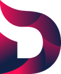

##What is Docksal?

Docksal is a tool for defining and managing development environments. It brings together common tools, minimizes configuration, 
and ensures environment consistency throughout your continuous integration workflow. See this [FFW blog post](https://ffwagency.com/blog/announcing-docksal-docker-based-development-environment) for more info about 
the motivation behind creating Docksal.

Docksal uses Docker to create fully containerized environments, and uses Virtual Box to support MacOS and Windows. 
Its main feature is the inclusion of a command-line tool, called `fin`, that simplifies the management of all components.

It comes preloaded with common Drupal development tools like drush and Drupal Console, as well as php tools like Composer, 
PHP Code Sniffer, and php-cli. It also comes with node, npm, ruby, bundler, and python. As well as WP-CLI for WordPress.

There is built-in support for Apache Solr, Varnish, Memcache, Selenium, and Behat. And since services are containerized with Docker, 
any other service needed for a project can be added.

##Key features

Docksal does more than simply manage containers. Below is a list of some of Docksal's key features. While it is not
limited to these features, we think you'll find these to be some of its main selling points.

- Fully [containerized environments](/docksal-stack).
    - all projects stay separated from each other
    - each can have its own requirements
    - each can have different versions of the same service
    - each can be managed independently (start, stop, restart, trash, etc.)
    - each can be extended with any service you want
- [Zero-configuration](/project-customize/#zero-configuration) projects - with two commands you can be up and running with an AMP stack without
having to create or understand any configurations.
- Easy to create [configurations](/project-customize) to partially or fully override any defaults.
- Tools such as drush, console, and WP-CLI are builtin so you don't need to have them installed locally.
- Automatic virtual host configuration ([except for Windows](/multiple-projects/#windows).)
- Support for [custom commands](/custom-commands) using any interpreter you want.
- Easily [share your site](/public-access) over the internet using ngrok. This lets show your project to others without having to 
move your project to a web host somewhere.

##What's in the software?

"Docksal" is an umbrella for all the components and services you get. It uses Docker to manage containers and Docker Compose to
manage the configurations, so almost anything you can do with Docker you can do with Docksal. There are also a number of 
containers managed by the Docksal team that are tuned for Docksal's most common use case, which is Drupal/PHP CMS development.

And along with this comes predefined ["stacks"](/project-customize/#default-configurations) that quickly and easily setup projects for you so you don't have
understand all the complexity in configuring containers. Docksal's main purpose is to make managing projects **easy**. We try to take care of most of the work for you,
so you focus on your project.

For those of you that are a little more particular about how you setup your projects, don't fret. You can choose to use your own, or any other, containers,
and setup the configurations how ever you like. Docksal's predefined services are provided to make things easy for anyone that doesn't know, or doesn't want to know,
how to manage it themselves.

With Docksal you also get `fin`, the command line tool used to manage your projects. Fin has builtin in commands for every day tasks, like 
stopping and starting services, importing and exporting databases, initializing projects, executing bash commands inside the containers, and adding ssh keys.
Fin is also easily extended with custom commands that can be universal to your computer, or unique for each project.